INTRODUCTION
-------------
Welcome to PhotoPhinder, an app that allows photographers to show off their work and others to find the perfect photographer for their needs. Our app allows customers to browse photos taken by real photographers with the ability to connect and set up photoshoots with them.

### Built With
* [React.js](https://reactjs.org/)
* [Node.js](https://nodejs.org/en/)
* [Firebase](https://firebase.google.com/)
* [Bulma.io](https://bulma.io/)

GETTING STARTED
---------------
### Prerequisites
Start by creating your Firebase database. This is where all your information  will be stored.
1. Go to https://firebase.google.com/ and click __Get Started__
2. Login to your preferred Google account.
3. Click on __Add Project__ and enter a project name when prompted
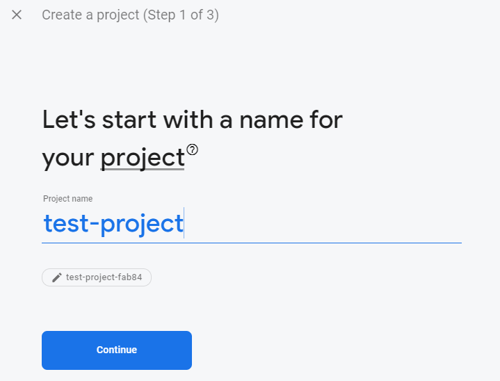

4. Then click **Create Project**
5. You should now be redirected to your firebase console. This is where all of your data will be stored. We will return to this later.
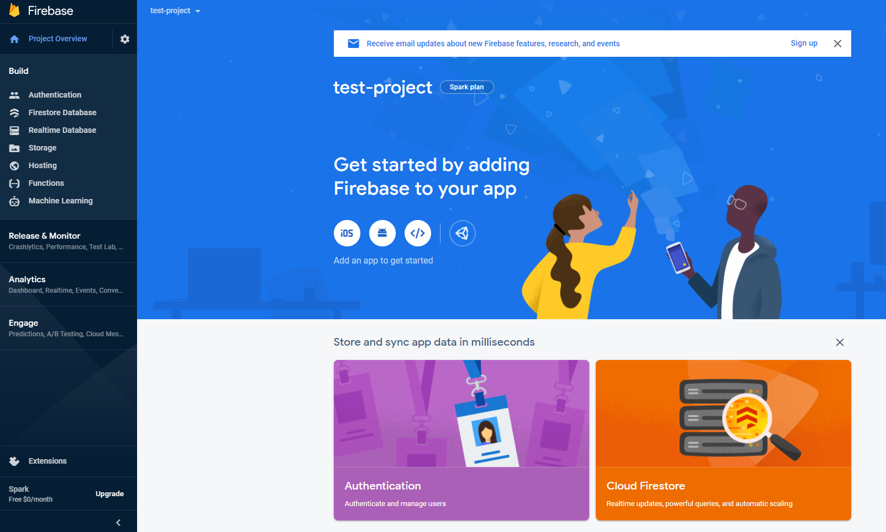


### Installation
1. Install [Node.js](https://nodejs.org/en/)
2. Clone this repository using the following command below

* ```git clone https://github.com/armaan-abraham/cs35L-final-project.git```

3. Change into the project directory

* ```cd cs35l-project-react-app```

4. Install the npm packages using

* ```npm install```

	- In the case installation may fail, the individual dependencies used are listed below
		- ```npm install firebase``` 
		- ```npm install react-router-dom``` 
		- ```npm install bulma``` 
5. Now we can continue configuring Firebase. Click on the HTML icon in the middle as we will be using Firebase for a web app.
6. Create a name for your app and you should now have a configuration key
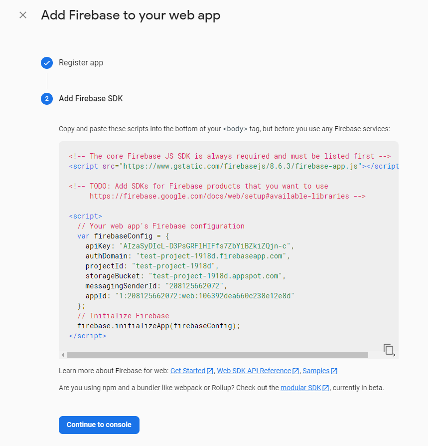

7. Navigate to the __firebase.js__ file in the source code and replace the configuration with your web apps configuration.
8. Now you are ready to get started.

USAGE
-----
Start the program by running ```npm start```  
### Front Page
This is the page you will see when you first run the app. It provides information about the app and the purpose behind it, along with tools for navigation. From here you can login / signup, check out other creator's photos, or go to your profile.

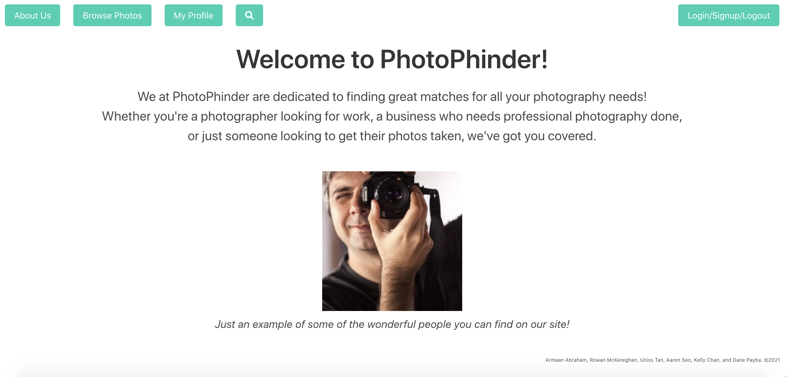

### Login 
This is where you will be prompted to login to your account. You can either login using the email and password you created, or signup using the __Sign Up__ button

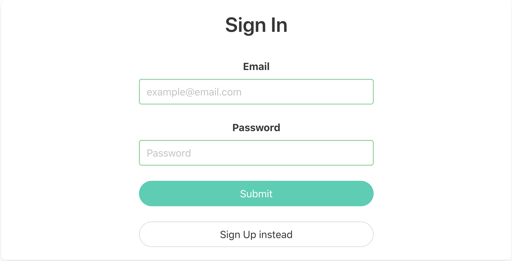

### Sign Up
Create an account from this page by insertinga  username, email, and password. The information you provide will then be stored in the database and be used to retrieve data about your account each time you log in.

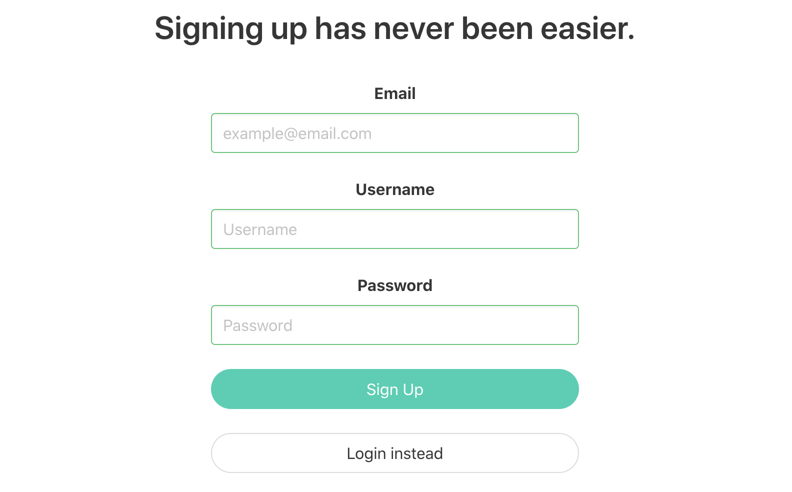

### Feed
This is where you can explore the content of all the creators. Use the arrow keys to navigate through the posts with the ability to like any pictures you enjoy. Each post will display the username of the creator as you will have the ability to go to their profile and contact them. You can also upload photos yourself using the upload button.

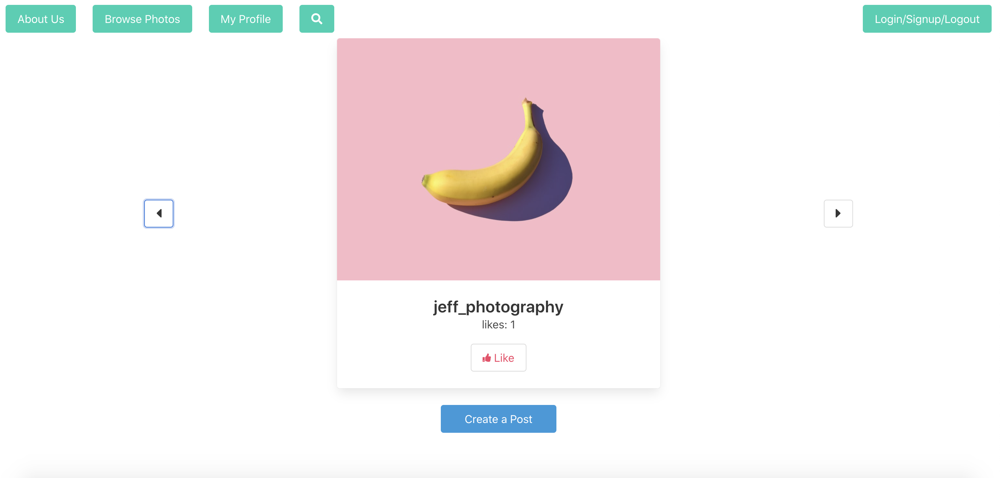

### Upload
Upload a photo to your profile by choosing a file and clicking upload. You will then be redirected back to the feed where you can see your photo has been posted.

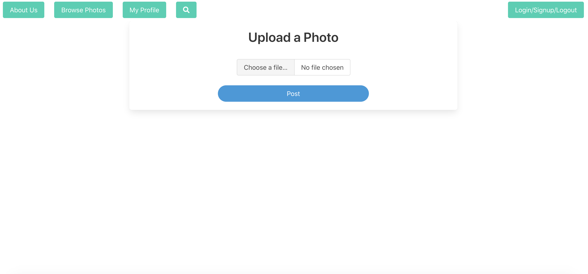

### Search
After scrolling through the feed and finding a photographer you're interested in, you can search up their name using the __Search__ bar. It will then display the photographer you want to contact along with all of their pictures.

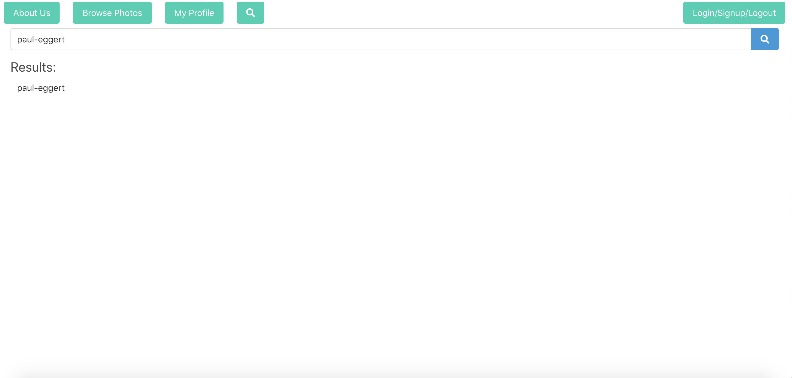

### Profile
This page contains all the pictures uploaded by the creator. From here, you can contact the creator by using the chat feature.

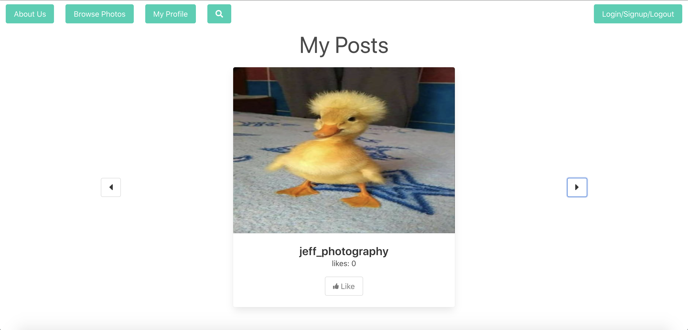

### Chat
Your own 1 on 1 conversation between the photographer and customer. Here you can arrange photoshoots and discuss any other details.

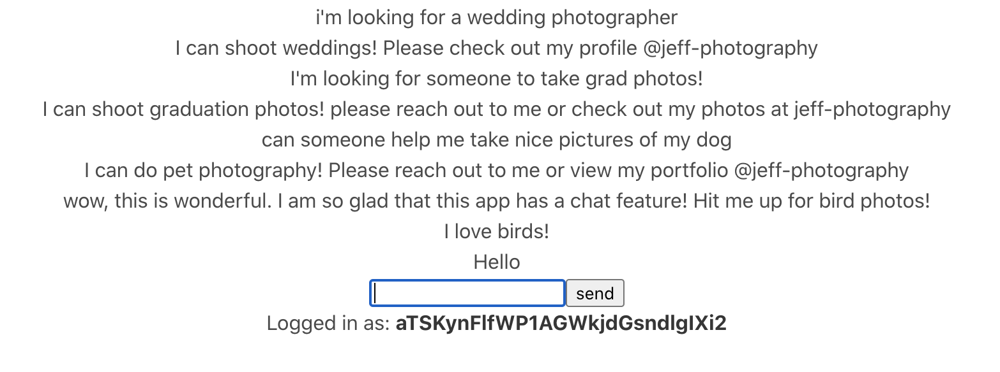